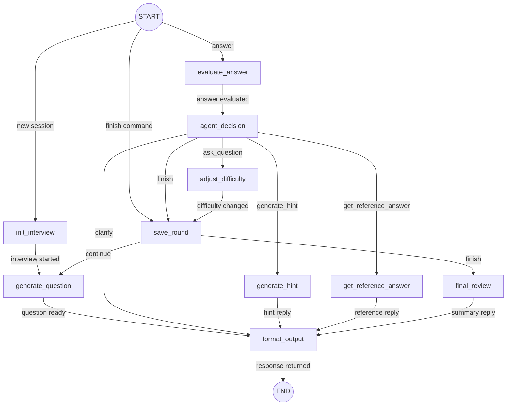

# Interview Mentor API

`Interview Mentor API` - учебный AI-агент для mock interview по техническим темам. Проект показывает, как собрать понятный LangGraph workflow вокруг локальной LLM в Ollama, сохранить состояние пользователя в JSON и дать удобный интерфейс через браузерный чат. Всё запускается через Docker Compose: Python, FastAPI, Ollama, модель и окружение живут в контейнерах.


## Что умеет проект

Проект умеет запускаться полностью через Docker Compose, автоматически поднимать Ollama и загружать модель `llama3.2:1b`, открывать локальный веб-чат на `http://localhost:8000`, начинать mock interview, задавать вопросы по теме `golang_backend`, принимать ответы пользователя, оценивать ответы через LLM, выбирать следующий шаг через LangGraph, просить уточнение, выдавать подсказку, показывать эталонный ответ, сохранять состояние сессии в JSON, завершать интервью с итоговым feedback, а также предоставлять REST API и Swagger UI для тестирования без Telegram и внешних bot API.

## Короткое описание графа

Граф симулирует работу AI-наставника по техническому собеседованию: агент начинает mock interview, задаёт вопрос, принимает ответ пользователя, оценивает его, сам выбирает следующий шаг и в конце выдаёт итоговый feedback. Узлы: `init_interview`, `generate_question`, `evaluate_answer`, `agent_decision`, `adjust_difficulty`, `save_round`, `generate_hint`, `get_reference_answer`, `final_review`, `format_output`. Рёбра: интервью начато, вопрос задан, ответ оценён, решение принято, сложность изменена, раунд сохранён, подсказка получена, эталонный ответ показан, финальный review создан, интервью завершено. State: сессия пользователя с темой, уровнем, текущим вопросом, ответом, оценкой, feedback, history, выбранным действием и итоговым review. Модель: `llama3.2:1b` через Ollama для генерации вопросов, оценки ответов, выбора действия и финального feedback.

## Архитектура

Проект разделён на несколько слоёв, чтобы его было удобно читать и расширять:

- `app/api` - HTTP endpoints FastAPI.
- `app/web` - встроенный браузерный чат без отдельной frontend-сборки.
- `app/services` - orchestration use-cases: интервью, сессии, форматирование ответов.
- `app/graph` - LangGraph state machine, nodes, routers и prompts.
- `app/llm` - клиент Ollama и фабрика `SystemMessage` / `HumanMessage`.
- `app/tools` - локальные tools на JSON-файлах: подсказки и эталонные ответы.
- `app/storage` - JSON-хранилище сессий.
- `app/schemas` - Pydantic-схемы для structured output и HTTP API.
- `scripts` - вспомогательные скрипты, включая генерацию `graph.png`.
- `docker` - Dockerfile и entrypoint-скрипты.

## Использованные библиотеки

| Библиотека | Для чего используется |
|---|---|
| `FastAPI` | HTTP API и выдача HTML-чата |
| `Uvicorn` | ASGI-сервер внутри контейнера `app` |
| `LangGraph` | Построение графа интервью и маршрутизация между узлами |
| `LangChain Core` | Сообщения `SystemMessage` и `HumanMessage` |
| `langchain-ollama` | Подключение к Ollama как к chat model |
| `Pydantic` | Structured output, валидация LLM-ответов и API-схем |
| `pydantic-settings` | Настройки через переменные окружения |
| | `pytest` | Тесты tools, router, схем и session storage |
| `httpx` | HTTP-клиент, полезен для тестов и диагностики |

## Использованные модели и роли

В проекте используется одна локальная модель: `llama3.2:1b` через Ollama. Она работает в нескольких ролях, заданных через отдельные prompts и раздельные `SystemMessage` / `HumanMessage`.

| Узел | Модель | Роль |
|---|---|---|
| `generate_question` | `llama3.2:1b` | Строгий технический интервьюер, который генерирует следующий вопрос |
| `evaluate_answer` | `llama3.2:1b` | Объективный оценщик, который возвращает `EvaluationResult` |
| `agent_decision` | `llama3.2:1b` | Управляющий интервью, который выбирает следующее действие |
| `final_review` | `llama3.2:1b` | Наставник, который составляет итоговый review |

Локальные tools не используют отдельную модель. `generate_hint` достаёт подсказку из `app/tools/data/hints.json`, а `get_reference_answer` достаёт эталонный ответ из `app/tools/data/reference_answers.json`.

## State графа

State хранится как обычный JSON-совместимый словарь `InterviewState`. Один пользователь = один JSON-файл в session storage.

Основные поля state:

- `user_id` - идентификатор пользователя.
- `chat_id` - идентификатор диалога, для HTTP API обычно равен `user_id`.
- `interview_started` - начато ли интервью.
- `topic` - тема интервью, по умолчанию `golang_backend`.
- `current_level` - текущий уровень, по умолчанию `junior`.
- `max_questions` - максимум вопросов, по умолчанию `3`.
- `current_question_index` - номер текущего вопроса.
- `current_question` - текст текущего вопроса.
- `current_question_key` - ключ вопроса для локальных tools.
- `current_answer` - последний ответ пользователя.
- `current_score` - оценка ответа от `0` до `10`.
- `current_verdict` - `strong`, `medium` или `weak`.
- `current_feedback` - комментарий оценщика.
- `current_missing_points` - список недостающих пунктов.
- `pending_action` - действие, выбранное агентом.
- `tool_result` - результат локального tool.
- `history` - история завершённых раундов.
- `final_summary`, `strong_sides`, `weak_sides`, `improvement_plan` - итоговый review.
- `bot_reply` - текст, который возвращается в чат/API.
- `error` - безопасно сохранённая ошибка, если что-то пошло не так.

## Узлы графа

Всего в графе 10 узлов: 7 основных и 3 вспомогательных.

| Узел | Тип | Что делает |
|---|---|---|
| `init_interview` | Основной | Начинает новую сессию интервью, выставляет стартовые флаги и готовит state к первому вопросу |
| `generate_question` | Основной | Вызывает LLM, генерирует один вопрос и `question_key`, учитывая тему, уровень и историю |
| `evaluate_answer` | Основной | Вызывает LLM и получает structured output `EvaluationResult` со score, verdict, feedback и missing points |
| `agent_decision` | Основной | Вызывает LLM и получает `DecisionResult`: что делать дальше и как менять сложность |
| `generate_hint` | Основной | Вызывает локальный JSON tool и возвращает подсказку по текущему вопросу |
| `get_reference_answer` | Основной | Вызывает локальный JSON tool и возвращает эталонный ответ по текущему вопросу |
| `final_review` | Основной | Вызывает LLM и формирует итоговый review по истории интервью |
| `adjust_difficulty` | Вспомогательный | Меняет уровень сложности по решению агента: `up`, `keep`, `down` |
| `save_round` | Вспомогательный | Сохраняет завершённый вопрос-ответ в `history` |
| `format_output` | Вспомогательный | Превращает state в человекочитаемый ответ для браузерного чата и API |

## Рёбра графа

Всего в графе 18 рёбер: 10 основных и 8 вспомогательных. По рёбрам: 10 основных - успешная линия интервью от старта до финального review, плюс ветки уточнения, подсказки и эталонного ответа; 8 вспомогательных - входы в граф, сохранение раунда, форматирование ответа и завершение выполнения.

| Ребро | Тип | Что означает |
|---|---|---|
| `START -> init_interview` | Вспомогательное | Вход в граф для новой сессии |
| `START -> evaluate_answer` | Вспомогательное | Вход в граф, когда пользователь прислал ответ |
| `START -> save_round` | Вспомогательное | Вход в граф, когда пользователь завершает интервью |
| `init_interview -> generate_question` | Основное | Интервью начато, можно задать первый вопрос |
| `generate_question -> format_output` | Вспомогательное | Вопрос нужно подготовить для ответа UI/API |
| `evaluate_answer -> agent_decision` | Основное | Ответ оценён, агент должен выбрать следующий шаг |
| `agent_decision -> adjust_difficulty` | Основное | Агент решил перейти к следующему вопросу |
| `agent_decision -> format_output` | Основное | Агент решил попросить уточнение |
| `agent_decision -> generate_hint` | Основное | Агент решил дать подсказку |
| `agent_decision -> get_reference_answer` | Основное | Агент решил показать эталонный ответ |
| `agent_decision -> save_round` | Основное | Агент решил завершить интервью |
| `adjust_difficulty -> save_round` | Вспомогательное | Сложность обновлена, текущий раунд нужно сохранить |
| `save_round -> generate_question` | Основное | Раунд сохранён, можно задать следующий вопрос |
| `save_round -> final_review` | Основное | Раунд сохранён, пора сформировать итоговый review |
| `generate_hint -> format_output` | Вспомогательное | Подсказку нужно отформатировать для пользователя |
| `get_reference_answer -> format_output` | Вспомогательное | Эталонный ответ нужно отформатировать для пользователя |
| `final_review -> format_output` | Вспомогательное | Итоговый review нужно отформатировать для пользователя |
| `format_output -> END` | Вспомогательное | Ответ готов, выполнение графа завершено |

## Mermaid-схема



## Как запустить проект локально

Локально здесь означает “на вашей машине через Docker”. Запускать Python на хосте не нужно.

1. Убедитесь, что установлен Docker и Docker Compose.

2. Скопируйте переменные окружения:

```bash
cp .env.example .env
```

3. Запустите весь стек:

```bash
docker compose up --build
```

4. Дождитесь, пока `ollama_init` скачает модель. В логах должно быть что-то вроде:

```text
Pulling model llama3.2:1b...
Ollama model initialization completed.
```

Если модель уже скачана, будет:

```text
Model llama3.2:1b already exists.
```

5. Откройте чат в браузере:

```text
http://localhost:8000
```

6. Swagger UI доступен здесь:

```text
http://localhost:8000/docs
```

## Как пользоваться чатом

На странице `http://localhost:8000` можно:

- выбрать `User ID`;
- нажать `Начать`;
- отвечать на вопросы в поле чата;
- нажать `Завершить`, чтобы получить итоговый feedback;
- нажать `Сбросить сессию`, чтобы начать заново.

## Как пользоваться API

Начать интервью:

```bash
curl -X POST http://localhost:8000/interviews/start \
  -H "Content-Type: application/json" \
  -d '{"user_id": 1}'
```

Ответить на текущий вопрос:

```bash
curl -X POST http://localhost:8000/interviews/answer \
  -H "Content-Type: application/json" \
  -d '{"user_id": 1, "text": "Goroutine - это легковесный поток выполнения в Go..."}'
```

Завершить интервью:

```bash
curl -X POST http://localhost:8000/interviews/finish \
  -H "Content-Type: application/json" \
  -d '{"user_id": 1}'
```

Сбросить сессию:

```bash
curl -X POST http://localhost:8000/interviews/reset \
  -H "Content-Type: application/json" \
  -d '{"user_id": 1}'
```

Посмотреть сохранённую сессию:

```bash
curl http://localhost:8000/interviews/1/session
```

## Docker Compose

Compose поднимает три сервиса:

| Сервис | Что делает |
|---|---|
| `ollama` | Запускает Ollama API и хранит модели в volume `ollama_data` |
| `ollama_init` | Одноразово проверяет модель и выполняет `ollama pull llama3.2:1b`, если модели нет |
| `app` | Запускает FastAPI, браузерный чат и REST API на порту `8000` |

Volumes:

- `ollama_data` - модели Ollama.
- `sessions_data` - JSON-сессии пользователей.

## Проверка Ollama

Проверить список моделей:

```bash
docker compose exec ollama ollama list
```

Проверить HTTP API Ollama:

```bash
curl http://localhost:11434/api/tags
```

## Генерация картинки графа

Файл `graph.png` уже лежит в корне проекта и используется в README. Если граф изменился, картинку можно перегенерировать. Текущая версия использует первый локальный renderer на `Pillow`: он не зависит от `mermaid.ink`, Node.js, Mermaid CLI или внешнего интернета, поэтому стабильно работает в Docker/WSL.

Через Docker, без локальной установки Python:

```bash
docker compose build app
docker compose run --rm --entrypoint python -v "$PWD:/workspace" app /app/scripts/render_graph_png.py /workspace/graph.png
```

Если Python и зависимости установлены локально, можно так:

```bash
python scripts/render_graph_png.py graph.png
```

## Тесты

Запуск тестов в контейнере:

```bash
docker compose run --rm app pytest
```

Тесты покрывают:

- чтение локальных tools из JSON;
- fallback для tools;
- маршрутизацию по action;
- сохранение и загрузку JSON-сессии;
- нормализацию structured output.

## Ограничения MVP

- Нет базы данных и Redis.
- Нет Telegram, webhook и внешних bot API.
- Нет streaming-ответов, API возвращает готовый результат шага.
- Tools локальные и читают JSON-файлы.
- Данные примеров есть только для `golang_backend / junior`.
- `llama3.2:1b` маленькая модель, поэтому prompts и fallback-и сделаны максимально прямолинейными.
- Для учебной простоты сессии сохраняются целиком в JSON после каждого шага.

## Что можно улучшить дальше

- Вынести HTML/CSS/JS из `app/web/chat_page.py` в полноценные static files.
- Добавить streaming ответа через Server-Sent Events.
- Сделать frontend на React/Vue/Svelte.
- Добавить CLI-клиент для терминального интервью.
- Добавить больше тем и уровней в JSON tools.
- Подключить другой transport отдельным слоем, не меняя LangGraph и services.


