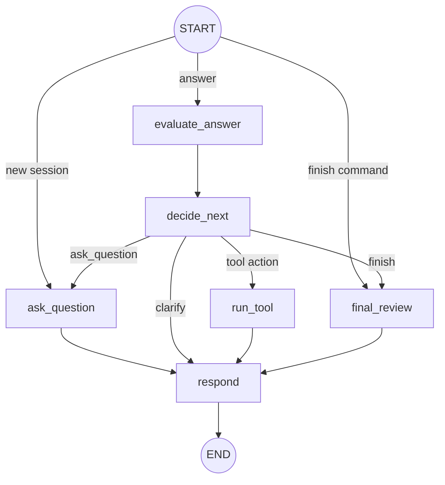

# Interview Mentor API

`Interview Mentor API` - учебный AI-агент для mock interview по техническим темам. Проект специально оставляет LangGraph видимым: граф собран вручную через `StateGraph`, узлы меняют общий state, а conditional edges показывают, как агент выбирает следующий шаг.

## Краткое описание

Граф симулирует AI-наставника для технического mock interview: агент начинает интервью, задаёт вопрос, принимает ответ, оценивает его, выбирает следующий шаг и в конце выдаёт итоговый feedback. Узлы: `ask_question`, `evaluate_answer`, `decide_next`, `run_tool`, `final_review`, `respond`. State хранит пользователя, тему, уровень, текущий вопрос, ответ, оценку, feedback, историю, выбранное действие, результат tool и итоговый review. Модель: `llama3.2:1b` через Ollama.

Проект запускается через Docker, поднимает Ollama, загружает `llama3.2:1b`, открывает веб-чат на `http://localhost:8000`, сохраняет сессии в JSON и даёт REST API со Swagger UI. Интервью работает по теме `golang_backend`: агент задаёт вопросы, оценивает ответы, может попросить уточнение, дать подсказку, показать эталонный ответ или завершить интервью.

5 основных узлов, 1 вспомогательный: `ask_question`, `evaluate_answer`, `decide_next`, `run_tool`, `final_review` выполняют основную логику интервью, а `respond` форматирует ответ для API и браузерного чата.

6 основных рёбер, 6 вспомогательных: основные рёбра ведут интервью от старта к вопросу, от ответа к оценке, от оценки к выбору следующего действия, дальше к следующему вопросу или финальному review. Вспомогательные рёбра обслуживают команду завершения, ветку tool, уточнение, форматирование ответа и выход из графа.

`llama3.2:1b` используется для генерации вопросов, оценки ответов, выбора действия агента и финального review. Локальные JSON tools работают без отдельной модели: `generate_hint` достаёт подсказку, а `get_reference_answer` достаёт эталонный ответ; оба вызываются через единый узел `run_tool`.

В локальной базе есть 13 вопросов по `golang_backend / junior`: goroutine, channel, mutex vs channel, context, defer, interfaces, error handling, slice vs array, concurrent map access, HTTP handlers, middleware, graceful shutdown и race condition.

## Что умеет проект

- запускает локальный HTTP API на FastAPI;
- открывает простой браузерный чат на `http://localhost:8000`;
- проводит mock interview по теме `golang_backend`;
- задаёт вопросы через Ollama-модель `llama3.2:1b`;
- оценивает ответы через structured output;
- выбирает следующий шаг через LangGraph;
- может попросить уточнение, дать подсказку или показать эталонный ответ;
- сохраняет сессии пользователей в JSON;
- завершает интервью итоговым feedback.

## Упрощённая архитектура

```text
app/
  main.py                  # FastAPI app + static UI
  config.py                # env settings
  dependencies.py          # сборка LLM, graph и session storage

  api/routes.py            # HTTP endpoints
  services/interview_service.py
  services/response_service.py

  graph/state.py           # InterviewState
  graph/builder.py         # StateGraph wiring
  graph/simple_nodes.py    # смысловые LangGraph nodes

  llm/client.py            # Ollama wrapper
  llm/prompts.py           # prompts + message builders

  schemas/__init__.py      # API и structured-output схемы
  storage/sessions.py      # JSON-сессии
  tools/local_tools.py     # локальные JSON tools
  static/                  # браузерный чат
```

## Docker

`docker/app/Dockerfile` собирает контейнер приложения на базе `python:3.11-slim`: устанавливает зависимости из `requirements.txt`, копирует `app`, `tests`, `scripts` и запускает FastAPI через `uvicorn app.main:app`. Контейнер ожидает, что API будет доступен на `0.0.0.0:8000`, а адрес Ollama придёт из переменной `OLLAMA_BASE_URL`.

`docker-compose.yml` поднимает весь локальный стек из трёх сервисов:

- `ollama` - запускает Ollama API на порту `11434` и хранит модели в volume `ollama_data`;
- `ollama_init` - один раз проверяет и скачивает модель `llama3.2:1b`, если её ещё нет;
- `app` - запускает FastAPI, REST API и браузерный чат на порту `8000`.

Для данных используются два volume: `ollama_data` хранит модели Ollama, а `sessions_data` хранит JSON-сессии пользователей между перезапусками контейнеров.

## LangGraph Workflow

Граф состоит из 6 узлов:

| Узел | Что делает |
|---|---|
| `ask_question` | Начинает интервью при необходимости, генерирует вопрос и обновляет `question_index` |
| `evaluate_answer` | Оценивает ответ кандидата через LLM structured output |
| `decide_next` | Выбирает действие агента и сохраняет завершённый раунд в `history` |
| `run_tool` | Запускает локальный JSON tool для подсказки или эталонного ответа |
| `final_review` | Формирует итоговый feedback |
| `respond` | Превращает state в текст ответа для API и чата |

Рёбра графа:

| Ребро | Что означает |
|---|---|
| `START -> ask_question` | Новая или сброшенная сессия начинает интервью с первого вопроса |
| `START -> evaluate_answer` | Пользователь прислал ответ на текущий вопрос |
| `START -> final_review` | Пользователь отправил команду завершения |
| `ask_question -> respond` | Новый вопрос готов к отправке в чат/API |
| `evaluate_answer -> decide_next` | Ответ оценён, можно выбрать следующий шаг |
| `decide_next -> ask_question` | Агент решил перейти к следующему вопросу |
| `decide_next -> run_tool` | Агент решил вызвать подсказку или эталонный ответ |
| `decide_next -> final_review` | Агент решил завершить интервью |
| `decide_next -> respond` | Агент решил попросить уточнение |
| `run_tool -> respond` | Результат локального tool готов к отправке |
| `final_review -> respond` | Итоговый feedback готов к отправке |
| `respond -> END` | Ответ сформирован, шаг графа завершён |



## State Графа

State хранится как JSON-совместимый словарь:

- `user_id`, `chat_id`;
- `interview_started`;
- `topic`, `level`, `max_questions`;
- `question_index`, `question`, `question_key`;
- `answer`;
- `score`, `verdict`, `feedback`, `missing_points`;
- `action`;
- `tool_result`;
- `history`;
- `final_summary`, `strong_sides`, `weak_sides`, `improvement_plan`;
- `bot_reply`.

Старые JSON-сессии с полями вида `current_question` автоматически мигрируются при загрузке.

## Использованные Библиотеки

| Библиотека | Для чего используется |
|---|---|
| `FastAPI` | HTTP API и выдача браузерного чата |
| `Uvicorn` | ASGI-сервер |
| `LangGraph` | Граф интервью и conditional routing |
| `LangChain Core` | `SystemMessage` и `HumanMessage` |
| `langchain-ollama` | Подключение к Ollama |
| `Pydantic` | API-схемы и structured output |
| `pydantic-settings` | Настройки из env |
| `pytest` | Тесты |

## Модели И Роли

В проекте используется одна локальная модель: `llama3.2:1b` через Ollama. Она вызывается в разных ролях:

| Узел | Роль модели |
|---|---|
| `ask_question` | Технический интервьюер, который генерирует следующий вопрос |
| `evaluate_answer` | Оценщик, который возвращает score, verdict, feedback и missing points |
| `decide_next` | Управляющий интервью, который выбирает следующее действие |
| `final_review` | Наставник, который анализирует историю и формирует итоговый feedback |

Локальные tools не используют отдельную модель. `generate_hint` читает подсказку из `app/tools/data/hints.json`, а `get_reference_answer` читает эталонный ответ из `app/tools/data/reference_answers.json`.

## Как Запустить Локально

Локальный запуск предполагает, что Ollama уже установлена и доступна на хосте.

1. Установите зависимости:

```bash
python -m venv .venv
source .venv/bin/activate
pip install -r requirements.txt
```

Для PowerShell активация окружения выглядит так:

```powershell
.\.venv\Scripts\Activate.ps1
```

2. Запустите Ollama и скачайте модель:

```bash
ollama pull llama3.2:1b
```

3. Создайте `.env` или задайте переменные окружения:

```bash
cp .env.example .env
```

Для локального запуска обычно нужен такой адрес Ollama:

```text
OLLAMA_BASE_URL=http://localhost:11434
```

4. Запустите API:

```bash
uvicorn app.main:app --reload --host 0.0.0.0 --port 8000
```

5. Откройте:

```text
http://localhost:8000
```

Swagger UI:

```text
http://localhost:8000/docs
```

## Как Запустить Через Docker

1. Скопируйте переменные окружения:

```bash
cp .env.example .env
```

2. Запустите стек:

```bash
docker compose up --build
```

3. Откройте чат:

```text
http://localhost:8000
```

Swagger UI:

```text
http://localhost:8000/docs
```

## API

Начать интервью:

```bash
curl -X POST http://localhost:8000/interviews/start \
  -H "Content-Type: application/json" \
  -d '{"user_id": 1}'
```

Ответить:

```bash
curl -X POST http://localhost:8000/interviews/answer \
  -H "Content-Type: application/json" \
  -d '{"user_id": 1, "text": "Goroutine - это легковесный поток выполнения в Go..."}'
```

Завершить:

```bash
curl -X POST http://localhost:8000/interviews/finish \
  -H "Content-Type: application/json" \
  -d '{"user_id": 1}'
```

Сбросить:

```bash
curl -X POST http://localhost:8000/interviews/reset \
  -H "Content-Type: application/json" \
  -d '{"user_id": 1}'
```

Посмотреть сессию:

```bash
curl http://localhost:8000/interviews/1/session
```

## Тесты

```bash
python -m pytest tests -q
```

В Docker:

```bash
docker compose run --rm app pytest
```

## Ограничения MVP

- Нет базы данных и Redis.
- Нет Telegram, webhook и внешних bot API.
- Нет streaming-ответов.
- Tools локальные и читают JSON-файлы.
- Данные примеров есть только для `golang_backend / junior`.
- `llama3.2:1b` маленькая модель, поэтому fallback-и сохранены.
