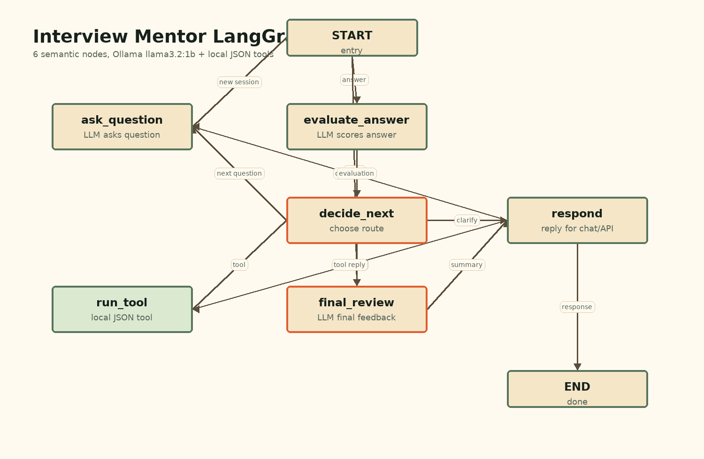
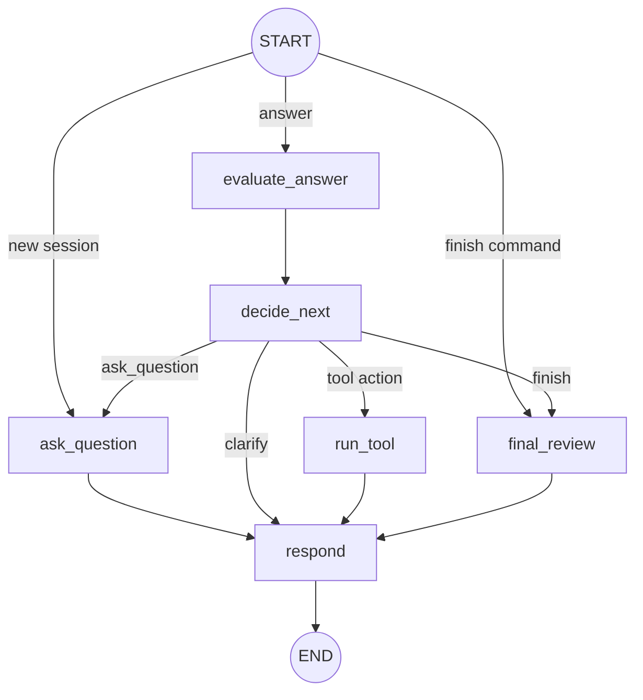

# Interview Mentor API

`Interview Mentor API` - учебный AI-агент для mock interview по техническим темам. Проект специально оставляет LangGraph видимым: граф собран вручную через `StateGraph`, узлы меняют общий state, а conditional edges показывают, как агент выбирает следующий шаг.



## Что умеет проект

- запускает локальный HTTP API на FastAPI;
- открывает простой браузерный чат на `http://localhost:8000`;
- проводит mock interview по теме `golang_backend`;
- задаёт вопросы через Ollama-модель `llama3.2:1b`;
- оценивает ответы через structured output;
- выбирает следующий шаг через LangGraph;
- может попросить уточнение, дать подсказку или показать эталонный ответ;
- сохраняет сессии пользователей в JSON;
- завершает интервью итоговым feedback.

## Упрощённая архитектура

```text
app/
  main.py                  # FastAPI app + static UI
  config.py                # env settings
  dependencies.py          # сборка LLM, graph и session storage

  api/routes.py            # HTTP endpoints
  services/interview_service.py
  services/response_service.py

  graph/state.py           # InterviewState
  graph/builder.py         # StateGraph wiring
  graph/simple_nodes.py    # все смысловые LangGraph nodes

  llm/client.py            # Ollama wrapper
  llm/prompts.py           # prompts + message builders

  schemas/__init__.py      # API и structured-output схемы
  storage/sessions.py      # JSON-сессии
  tools/local_tools.py     # локальные JSON tools
  static/                  # браузерный чат
```

## LangGraph workflow

Граф теперь состоит из 6 смысловых узлов:

| Узел | Что делает |
|---|---|
| `ask_question` | Начинает интервью при необходимости, генерирует вопрос и обновляет `question_index` |
| `evaluate_answer` | Оценивает ответ кандидата через LLM structured output |
| `decide_next` | Выбирает действие агента и сохраняет завершённый раунд в `history` |
| `run_tool` | Запускает локальный JSON tool для подсказки или эталонного ответа |
| `final_review` | Формирует итоговый feedback |
| `respond` | Превращает state в текст ответа для API и чата |

Conditional entry point:

- новая или сброшенная сессия идёт в `ask_question`;
- обычный ответ пользователя идёт в `evaluate_answer`;
- команда завершения идёт в `final_review`.

Conditional edges после `decide_next`:

- `ask_question` - перейти к следующему вопросу;
- `run_tool` - дать подсказку или эталонный ответ;
- `final_review` - завершить интервью;
- `respond` - попросить уточнение.



## State графа

State хранится как JSON-совместимый словарь:

- `user_id`, `chat_id`;
- `interview_started`;
- `topic`, `level`, `max_questions`;
- `question_index`, `question`, `question_key`;
- `answer`;
- `score`, `verdict`, `feedback`, `missing_points`;
- `action`;
- `tool_result`;
- `history`;
- `final_summary`, `strong_sides`, `weak_sides`, `improvement_plan`;
- `bot_reply`.

Старые JSON-сессии с полями вида `current_question` автоматически мигрируются при загрузке.

## Использованные библиотеки

| Библиотека | Для чего используется |
|---|---|
| `FastAPI` | HTTP API и выдача браузерного чата |
| `Uvicorn` | ASGI-сервер |
| `LangGraph` | Граф интервью и conditional routing |
| `LangChain Core` | `SystemMessage` и `HumanMessage` |
| `langchain-ollama` | Подключение к Ollama |
| `Pydantic` | API-схемы и structured output |
| `pydantic-settings` | Настройки из env |
| `pytest` | Тесты |
| `Pillow` | Локальная генерация `graph.png` |

## Как запустить через Docker

1. Скопируйте переменные окружения:

```bash
cp .env.example .env
```

2. Запустите стек:

```bash
docker compose up --build
```

3. Откройте чат:

```text
http://localhost:8000
```

Swagger UI:

```text
http://localhost:8000/docs
```

## API

Начать интервью:

```bash
curl -X POST http://localhost:8000/interviews/start \
  -H "Content-Type: application/json" \
  -d '{"user_id": 1}'
```

Ответить:

```bash
curl -X POST http://localhost:8000/interviews/answer \
  -H "Content-Type: application/json" \
  -d '{"user_id": 1, "text": "Goroutine - это легковесный поток выполнения в Go..."}'
```

Завершить:

```bash
curl -X POST http://localhost:8000/interviews/finish \
  -H "Content-Type: application/json" \
  -d '{"user_id": 1}'
```

Сбросить:

```bash
curl -X POST http://localhost:8000/interviews/reset \
  -H "Content-Type: application/json" \
  -d '{"user_id": 1}'
```

Посмотреть сессию:

```bash
curl http://localhost:8000/interviews/1/session
```

## Тесты

```bash
python -m pytest tests -q
```

В Docker:

```bash
docker compose run --rm app pytest
```

## Генерация картинки графа

```bash
python scripts/render_graph_png.py graph.png
```

## Ограничения MVP

- Нет базы данных и Redis.
- Нет Telegram, webhook и внешних bot API.
- Нет streaming-ответов.
- Tools локальные и читают JSON-файлы.
- Данные примеров есть только для `golang_backend / junior`.
- `llama3.2:1b` маленькая модель, поэтому fallback-и сохранены.
